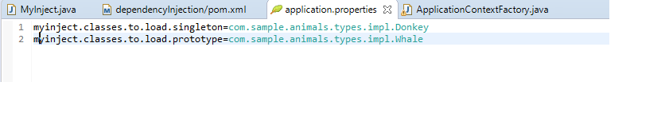

# Dependency Injection POC

MyInject class is the main class to run the project,

Define singleton or prototype packages in resource applicaiton.properties as a comma separated


ApplicationContextFactory class read the packages from resource files to create Singleton or Prototype objects
Singleton:- The object is created it stored into the HashMap, as per the request it return the existing object from HashMap
Prototype:- The object return to the base class

Use below commands to run the application from command line
```
$ cd dependencyInjection
$ mvn clean install
$ java -jar target/dependencyInjection-1.0-SNAPSHOT.jar -h
```
